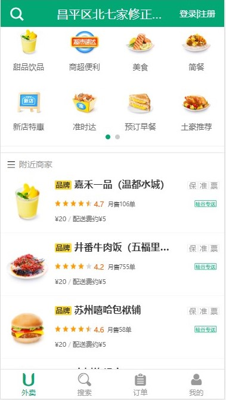
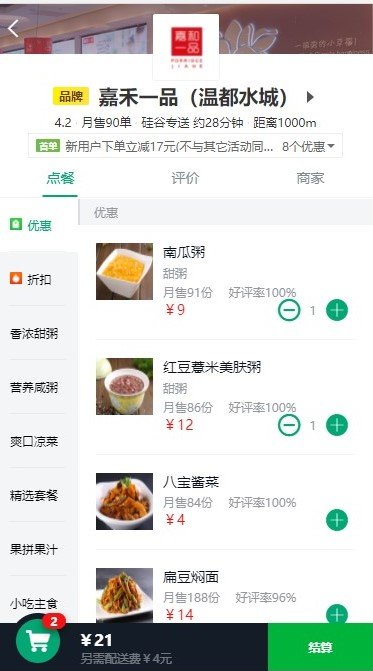
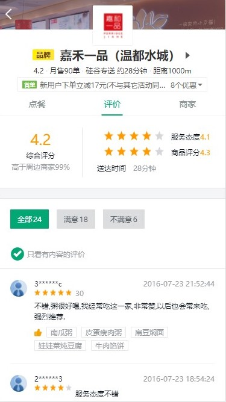
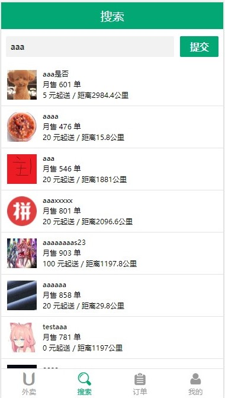
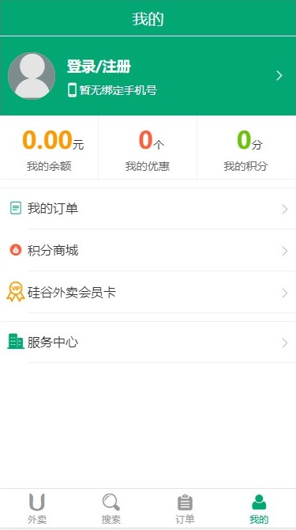
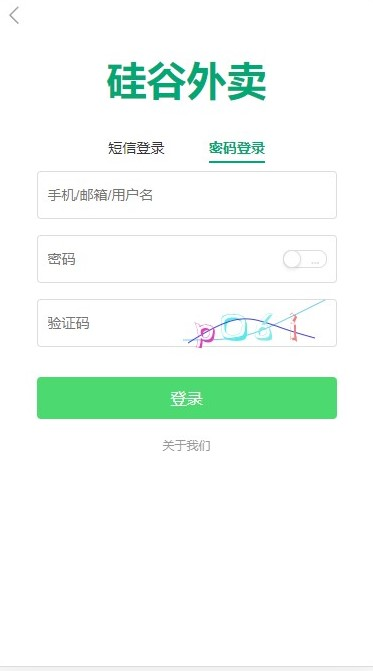

# Vue 外卖项目（买家版）

## 1. 项目概述

- 此项目为外卖 Web App (SPA) 
- 包括商家, 商品, 购物车, 用户等多个子模块 
- 使用 Vue 全家桶 + ES6 + Webpack  等前端最新最热的技术 
- 采用模块化、组件化、工程化的模式开发 

## 2. 技术栈

- vue + vue-cli + vue-router + vuex + vue-lazyload	（vue全家桶）
- better-scroll + swiper  (滑动库)   moment + date-fns （日期处理）
- mock + vue-resource + axios （前后台交互）
- ES6 + babel （模块化）webpack + eslint （工程化）

## 3. 完成功能

-  展示所选地址附近商家列表 -- 完成
-  搜索美食，餐馆 -- 完成
-  餐馆食品列表页 -- 完成
-  购物车功能 -- 完成
-  店铺评价页面 -- 完成
-  单个食品详情页面 -- 完成
-  商家详情页 -- 完成
-  登录、注册 -- 完成
-  发送短信 -- 完成
- 个人中心 -- 完成
- 更多功能 -- 有待完成

## 4. 项目运行

```
先启动后台项目
cd Gshop-server
npm install 
npm start
再启动前端项目
cd Gshop-client
npm install 
npm start
```

## 5. 项目预览

首页

 

商家主页

 

商品评价

 

搜索页面

 

个人界面

 

登陆界面

 
